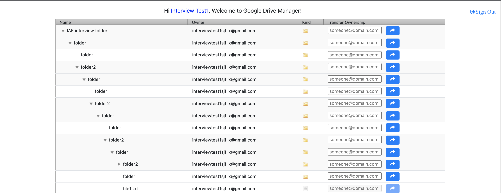
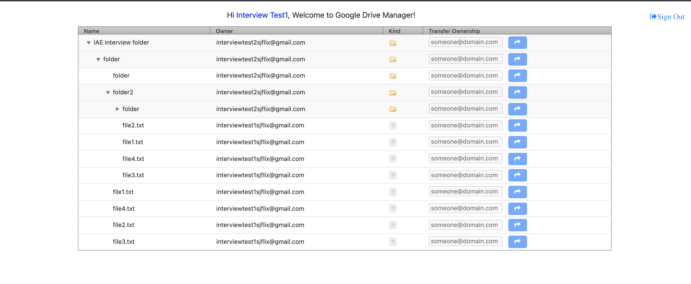
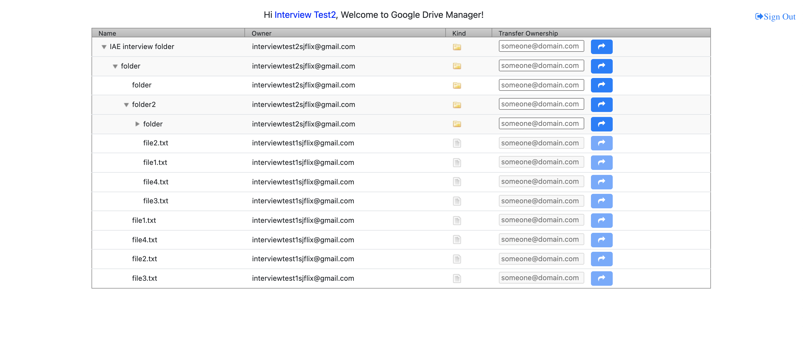

**Google Drive Manager**
- The app provides a viewer for your Google Drive folders and files and a way to transfer ownership for folders you own.
It has been structured as MVC application with the backend APIs proxying the API requests to Google Drive and the UI 
being generated from server side templating. 

**Stack**
- JDK 11
- Spring Boot
- Spring Security Oauth2
- Thymeleaf templating

**Assumptions**
- Reviewer would create or have a Google Drive API app available and can provide their client_id and client_secret when running locally.
- Test Files cannot be transferred to another user due to sharing restrictions of non-Google entities and approval process for the new owner.
- Session Cookie based Auth using Spring Security has been used along with server side template option chosen, closing of browser 
session would require re-login. The OAuth tokens can be extended to publish JWT for supporting a standalone front-end app in the future.
- UI experience has been kept simple in this iteration allowing only Drives with less than 1000 folders/files to design UI experience with 
appropriate features around pagination and filtering in the future.

**Features Supported**
- Google SSO login and logout
- Drive view of files and folders navigable in a TreeView
- Change Ownership of folders where permissible

**Instructions**
- Docker file has been added but mvn spring boot might be faster for the reviewer to try out if reviewer has mvn3 and jdk11 already installed.
- Startup command to run from home folder of the project.
  - mvn spring-boot:run -Dspring-boot.run.arguments="--spring.security.oauth2.client.registration.google.client-id=<client-id> --spring.security.oauth2.client.registration.google.client-secret=<secret>"
- Visit http://localhost:8080 which would trigger the Google SSO and present you with your drive files upon success. Ensure to check Drive access when prompted by Google.
- You can sign out from the session after testing from the home page or close your browser to invalidate the session.

**Design/Implementation/Testing gaps not covered yet**
- Test Coverage(Unit, Integration, Performance, Security)
- Few areas of the blocking code needs to be made async during fetch of files and needs to be considered
with the API design of filters.
- Design Documentation or Sequence Diagram to explain the e2e workflow.
- Error Handling for Drive API nuances for different error codes
- User messaging for specific errors
- A standalone front-end app using JWT tokens instead of session based tokens.

**Screenshots**
Files View Test User 1 Before Sharing]

Files View Test User 1 After Sharing]

Files View Test User 2 After Sharing]

**References**
* [Thymeleaf](https://docs.spring.io/spring-boot/docs/2.6.0/reference/htmlsingle/#boot-features-spring-mvc-template-engines)
* [OAuth2 Client](https://docs.spring.io/spring-boot/docs/2.6.0/reference/htmlsingle/#web.security.oauth2)
* [Spring Security](https://docs.spring.io/spring-boot/docs/2.6.0/reference/htmlsingle/#web.servlet.spring-mvc.template-engines)
* [jQuery Treetable Plugin](http://ludo.cubicphuse.nl/jquery-treetable/)
* [API Batch](https://developers.google.com/drive/api/v3/batch)
* [Transfer Ownership Of Non-Google Native Files](https://support.google.com/drive/thread/41105461/can-t-transfer-ownership-in-google-drive-of-a-file-i-own-doesn-t-give-me-the-make-owner-option)
